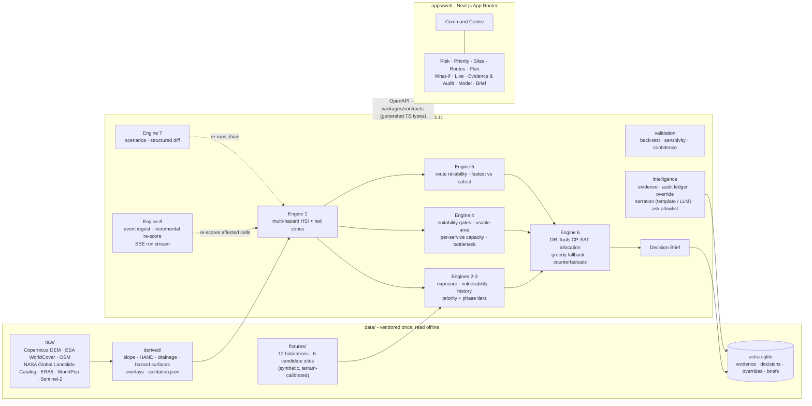

# Architecture

ASTRA is one FastAPI service and one Next.js application over a vendored study
area. There are no microservices, and no external network call sits on the
critical path of a demonstration.



## Responsibilities

| Layer | Code | Responsibility |
|---|---|---|
| Domain | `apps/api/astra/domain` | Pydantic models, enums, the single versioned `model_config.py` (every weight, threshold and norm), the formula registry, the standing notices |
| Data | `apps/api/astra/data` | Study area, provenance registry, fixture loading, the blocking integrity gate, the SQLite store |
| Engines | `apps/api/astra/engines` | Deterministic computation. `hazard.py`, `zones.py`, `priority.py`, `capacity.py`, `landcover_ml.py`, `routes.py`, `network.py`, `optimizer.py`, `livelihood.py`, `scenario.py`, `live.py`, `pipeline.py`, `validation.py`, `evidence.py`, `audit.py`, `narration.py`, `ask.py`, `brief.py` |
| API | `apps/api/astra/api` | Routers and response schemas. Serialisers are shared (`serialise_plan`, `serialise_zones`, `plan_dependencies`) so a figure has one code path to every screen |
| Contracts | `packages/contracts` | `openapi.json` exported from the app and `src/api.ts` generated from it. CI fails if either drifts |
| Web | `apps/web` | Server components fetch from the API and render; client components handle interaction, the map (MapLibre + deck.gl), the execution graph (React Flow over SSE) and Demo Mode |

## Single source of numeric truth

The frontend computes no displayed metric. Every figure is a field of an API
response typed by the generated contracts. Where two screens show the same
figure, they read it through the same serialiser: the Decision Brief, for
example, builds its plan totals with the Plan screen's `serialise_plan`, its
capacity totals with the Sites screen's `total_effective_capacity`, and its
route dependencies with the What-If screen's `plan_dependencies`.
`tests/test_brief.py` asserts those figures are equal across endpoints.

## The standing state

Baseline engine runs are computed once at startup and cached. The live pipeline
keeps an event log and a registry of runs; the most recent completed run is the
**standing state** that the Command Centre, the Live screen and the Decision
Brief read. A reset clears the log, and the baseline is back exactly, because
live state is derived from the log rather than edited in place.

## Real-time path

```
POST /events ─▶ RunRegistry.start ─▶ worker thread
                                      INGEST → HAZARD (affected cells only)
                                      → EXPOSURE+VULNERABILITY → SITE CAPACITY
                                      → ROUTE RELIABILITY → OPTIMISATION → DECISION BRIEF
                                      each stage appends a StageEvent with its computed payload
GET /runs/{id}/stream ─▶ SSE frames replayed from the first event ─▶ React Flow execution graph
```

A graph node lights up only when its `stage_started` frame arrives. A run that
invalidates planned movements marks the plan *requires review* and names the
movements.

## The AI boundary

- **Deterministic core.** Every score, zone, capacity, rank and assignment comes
  from a formula in the registry or from the CP-SAT solver.
- **ML for perception only.** `landcover_ml.py` is a CPU Random Forest over
  Sentinel-2 indices, used as a refinement of the ESA WorldCover usable-area
  estimate and reported with its agreement.
- **LLM for narration only.** `narration.py` receives finished structured
  results, and any number in its output that is not in that result causes the
  output to be discarded in favour of the deterministic template. With no key the
  product runs identically in template mode. `ask.py` maps questions to a fixed
  allowlist of accessors; there is no query language, filesystem or shell path.

## Performance decisions

- Engines warm at API startup; baseline results are cached, so screen requests
  serialise rather than recompute.
- Zone geometry is rounded to five decimal places (about 1 m, against 100 m
  cells) in the wire format only, which cut the zone payload every map screen
  downloads by 38%.
- The web client defaults to `http://127.0.0.1:8000`: on Windows, `localhost`
  resolves to IPv6 first and each refused attempt cost about 200 ms per
  server-side fetch.
- The MapLibre instance is created once per screen; handlers are read through
  refs so a re-render never tears it down.
- The layout reads `/health` once per request (`react.cache`) for both the status
  strip and the "How this works" notice.

## Deployment

- `docker-compose.yml` runs both services locally and offline.
- `railway.json` (web) and `railway.api.json` (API) configure two Railway
  services from the repository Dockerfiles, with health checks.
- CI (`.github/workflows/ci.yml`): ruff, fixture gate, pytest, back-test drift
  check, OpenAPI and TypeScript contract drift, `tsc`, ESLint, `next build`, and
  Playwright against the real API.
